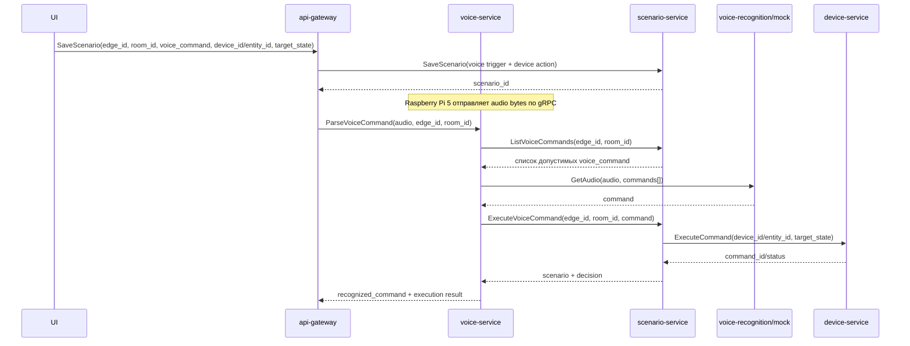

# Голосовой Сценарий: Полный Flow

## Что реализовано

В системе появился полный online-flow голосового управления устройством через заранее заведенный сценарий.

Участвующие сервисы:

- `api-gateway`
- `scenario-service`
- `voice-service`
- внешний `voice-recognition-service` c временным `mock`-режимом внутри `voice-service`

## Смысл сценария

Пользователь в UI создает голосовой сценарий:

- задает `voice_command`, например `включи свет в гостиной`
- выбирает `edge_id`
- при необходимости ограничивает сценарий `room_id`
- связывает голосовую команду с действием над устройством:
  - `device_id` или `entity_id`
  - `target_state`

После этого сценарий хранится в `scenario-service` как обычный сценарий, но с триггером:

```text
trigger_type = voice_command
command_name = <голосовая команда>
```

## Runtime flow



## Где хранится логика

### `api-gateway`

Отвечает за удобный контракт для UI:

- принимает упрощенный запрос создания голосового сценария
- превращает его во внутренний `Scenario`
- проксирует распознавание и исполнение голосовой команды в `voice-service`

### `scenario-service`

Является владельцем бизнес-логики сценариев:

- хранит сценарии
- отдает список допустимых голосовых команд для конкретного `edge_id` и `room_id`
- по распознанной команде выбирает нужный сценарий
- исполняет действие через `device-service`

### `voice-service`

Является orchestrator для голосового ввода:

- получает аудио
- запрашивает у `scenario-service` список допустимых голосовых сценариев
- отправляет аудио и список команд в `voice-recognition-service`
- получает выбранную команду
- инициирует выполнение сценария через `scenario-service`

## Mock-режим распознавания

Пока внешний `voice-recognition-service` не готов, внутри `voice-service` работает `mock`.

Поведение `mock`:

- если задан `VOICE_RECOGNITION_MOCK_COMMAND`, выбирается он
- иначе `mock` пытается найти имя команды в строковом представлении входного массива байт
- если не нашел, выбирает первую допустимую команду

Это позволяет уже сейчас тестировать end-to-end flow без нейросети.

## Новые gRPC-контракты

### `scenario-service`

Добавлены RPC:

- `ListVoiceCommands`
- `ExecuteVoiceCommand`

И расширен `Trigger` полем:

- `command_name`

### `voice-service`

`ParseVoiceCommand` теперь означает полный flow:

- выбрать сценарий
- исполнить его
- вернуть результат выполнения

### `voice-recognition`

Подготовлен proto-контракт будущего сервиса:

```proto
message GetAudioRequest {
  bytes chunk = 1;
  repeated Command commands = 2;
}

message GetAudioResponse {
  string command = 1;
}
```

## Что это дает дальше

Следующий логичный шаг после этого фундамента:

1. добавить HTTP-ручки в `api-gateway` для UI;
2. добавить интеграционные тесты на flow `save scenario -> parse voice -> execute device action`;
3. подключить реальный `voice-recognition-service` вместо `mock`.
