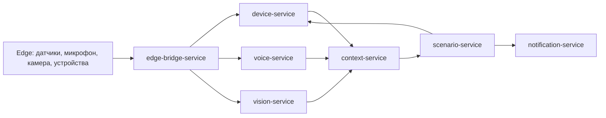
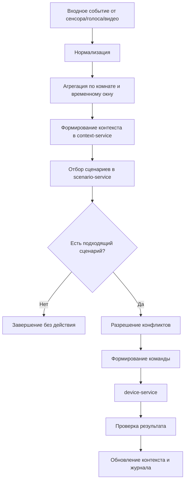
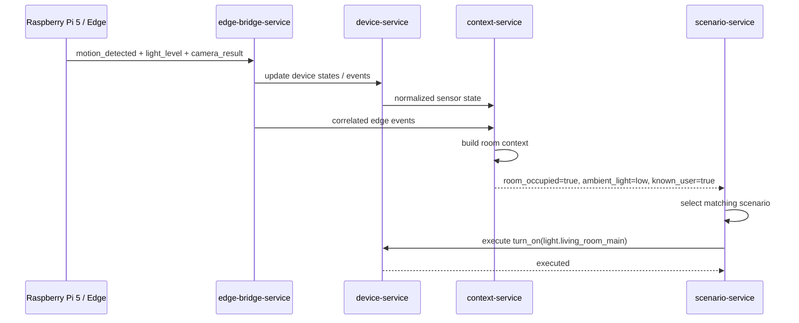

# Алгоритм управления сценариями на основе мультисенсорного анализа

## 1. Назначение алгоритма

Алгоритм управления сценариями на основе мультисенсорного анализа предназначен для выбора корректного управляющего воздействия на устройства умного помещения не по одному событию, а по совокупности разнородных источников данных. Такой подход позволяет уменьшить число ложных срабатываний, повысить точность выбора сценария и обеспечить более устойчивую работу системы в реальных условиях.

В рамках архитектуры VPS-контура алгоритм опирается на следующие сервисы:

- `edge-bridge-service` принимает события и аудио с граничного контура на `Raspberry Pi 5`;
- `device-service` хранит устройства, их состояния и исполняет команды;
- `voice-service` обрабатывает голосовой ввод;
- `vision-service` формирует результаты видеоаналитики;
- `context-service` агрегирует данные разных источников и формирует контекст;
- `scenario-service` принимает финальное решение о запуске сценария;
- `notification-service` отправляет тревожные и сервисные уведомления.

## 2. Смысл мультисенсорного анализа

Под мультисенсорным анализом понимается объединение нескольких каналов наблюдения за состоянием помещения:

- телеметрии от `Zigbee`-датчиков;
- текущих состояний устройств;
- результатов голосового распознавания;
- результатов видеоаналитики;
- пространственного контекста;
- временного контекста;
- режимов работы системы.

Вместо простого правила вида «если сработал датчик движения, то включить свет» система использует более сложную модель:

- есть ли человек в комнате;
- подтверждено ли присутствие несколькими источниками;
- достаточно ли освещено помещение;
- не активирован ли режим охраны;
- не противоречит ли действие более приоритетному сценарию;
- не является ли событие ложным или шумовым.

## 3. Роль `context-service`

`context-service` является центральным элементом мультисенсорного алгоритма. Его задача состоит не в прямом управлении устройствами, а в преобразовании сырых событий в осмысленное состояние среды.

### Основные функции `context-service`

- нормализация данных из разных источников;
- агрегация событий по `edge`, комнате, пользователю и временному окну;
- вычисление производных признаков;
- оценка достоверности текущего состояния;
- предоставление итогового контекста в `scenario-service`.

### Примеры производных признаков

- `room_occupied = true`
- `presence_confidence = 0.86`
- `ambient_light = low`
- `known_user_detected = true`
- `security_mode = armed`
- `voice_command_active = "включи свет в гостиной"`
- `situation_type = normal | suspicious | emergency`

Именно поэтому `context-service` в этой главе является слоем fusion-анализа: он связывает датчики, голос, видео и текущее состояние устройств в единый контекст принятия решения.

## 4. Входные данные алгоритма

На вход алгоритма поступают следующие типы данных:

### 4.1. Данные сенсоров

- движение;
- температура;
- влажность;
- освещенность;
- открытие двери или окна;
- значения других `Zigbee`-датчиков.

### 4.2. Данные устройств

- текущее состояние исполнительного устройства;
- факт успешного или неуспешного выполнения команды;
- доступность устройства.

### 4.3. Голосовые данные

- аудиофрагмент;
- распознанная команда;
- confidence распознавания;
- привязка голосовой команды к конкретному сценарию.

### 4.4. Видеоаналитика

- обнаружено лицо;
- лицо идентифицировано или не идентифицировано;
- подтверждено присутствие человека;
- обнаружен посторонний.

### 4.5. Контекст среды

- комната;
- помещение;
- время суток;
- режим охраны;
- активные ограничения и приоритеты.

## 5. Выходные данные алгоритма

Результатом работы алгоритма являются:

- выбранный сценарий;
- итоговое решение;
- команда устройству;
- уведомление;
- отказ от действия при недостатке контекста;
- запись результата в журнал решений.

## 6. Общая логика алгоритма

Алгоритм состоит из семи последовательных стадий.

### 6.1. Сбор событий

Система принимает входные данные из граничного контура и внутренних сервисов.

Источники:

- `edge-bridge-service` передает события датчиков, состояния устройств и аудио с `Raspberry Pi 5`;
- `voice-service` передает результат голосового распознавания;
- `vision-service` передает результат видеоаналитики;
- `device-service` передает актуальные состояния устройств.

### 6.2. Нормализация

Данные преобразуются в единый внутренний формат:

- `event_id`
- `edge_id`
- `room_id`
- `entity_id`
- `source_type`
- `event_type`
- `value/state`
- `occurred_at`

На этой стадии устраняются различия между источниками и подготавливается общая модель события.

### 6.3. Агрегация и корреляция

События группируются по:

- граничному узлу;
- комнате;
- временному окну;
- пользователю или объекту наблюдения;
- типу активности.

Здесь же выполняется корреляция нескольких источников. Например:

- движение + низкая освещенность;
- голосовая команда + присутствие пользователя;
- открытие двери + обнаружение постороннего по видео.

### 6.4. Построение контекста

`context-service` вычисляет итоговое состояние среды на основе агрегированных данных:

- определяет, занята ли комната;
- оценивает уровень освещенности;
- определяет наличие пользователя;
- оценивает риск ситуации;
- фиксирует активные команды и ограничения.

### 6.5. Отбор подходящих сценариев

`scenario-service` запрашивает или получает сформированный контекст и выбирает сценарии, условия которых удовлетворяются.

На этом этапе используются:

- триггеры сценариев;
- контекстные условия;
- приоритеты;
- доступность устройств;
- ограничения режима безопасности.

### 6.6. Разрешение конфликтов

Если найдено несколько подходящих сценариев, применяется механизм приоритезации:

- сначала выбираются защитные и аварийные сценарии;
- затем сценарии, инициированные явной командой пользователя;
- затем фоновые сценарии автоматизации;
- при равенстве используется приоритет сценария;
- при невозможности безопасного выбора действие блокируется.

### 6.7. Исполнение и контроль результата

После выбора сценария:

- `scenario-service` формирует действие;
- `device-service` исполняет команду;
- состояние устройства обновляется;
- результат сравнивается с ожидаемым;
- при необходимости формируется уведомление.

## 7. Формальное описание алгоритма

```text
1. Получить событие E из одного или нескольких источников.
2. Выполнить нормализацию события E -> N.
3. Поместить N в буфер корреляции по edge_id, room_id и временному окну.
4. Извлечь связанный набор наблюдений O.
5. На основе O вычислить контекст C.
6. Выбрать множество кандидатов сценариев S, удовлетворяющих C.
7. Если S пусто, завершить обработку без действия.
8. Если |S| > 1, выполнить разрешение конфликтов и получить сценарий S*.
9. Сформировать действие A для выбранного сценария S*.
10. Передать A в device-service.
11. Получить результат исполнения R.
12. Сохранить решение и обновить контекст.
13. При необходимости отправить уведомление.
```

## 8. Архитектурная схема алгоритма



## 9. Диаграмма прохождения события



## 10. Пример работы алгоритма

Рассмотрим сценарий автоматического включения света вечером при входе пользователя в комнату.

### 10.1. Условия

В системе присутствуют:

- датчик движения в гостиной;
- датчик освещенности;
- камера;
- светильник `light.living_room_main`;
- сценарий «Включение света в гостиной».

### 10.2. Сценарий

Сценарий содержит:

- триггер: зафиксировано движение;
- условия:
  - освещенность низкая;
  - в комнате обнаружен человек;
  - режим охраны не активен;
- действие:
  - включить свет в гостиной.

### 10.3. Ход выполнения

1. Датчик движения на `Raspberry Pi 5` фиксирует активность.
2. Через `edge-bridge-service` событие поступает в `VPS`.
3. `device-service` обновляет состояние датчика.
4. Одновременно поступают данные от датчика освещенности и камеры.
5. `context-service` объединяет все наблюдения и делает вывод:
   - комната занята;
   - естественного света недостаточно;
   - обнаружен штатный пользователь;
   - ситуация нормальная.
6. `scenario-service` выбирает сценарий освещения.
7. Формируется команда на включение `light.living_room_main`.
8. `device-service` фиксирует и исполняет команду.
9. После подтверждения результата контекст обновляется.

## 11. Диаграмма примера



## 12. Почему здесь нужен `context-service`

Если исключить `context-service`, то `scenario-service` будет вынужден сам:

- анализировать сырые события;
- объединять данные от разных сенсоров;
- рассчитывать признаки присутствия;
- оценивать достоверность ситуации.

Это приведет к смешению двух независимых задач:

- анализа среды;
- выбора и исполнения сценария.

Использование `context-service` позволяет:

- вынести мультисенсорный анализ в отдельный слой;
- переиспользовать один и тот же контекст в разных сценариях;
- упростить логику `scenario-service`;
- сделать архитектуру более наглядной и обоснованной для дипломной работы.

## 13. Итог

Таким образом, алгоритм управления сценариями на основе мультисенсорного анализа включает сбор данных, нормализацию, контекстную агрегацию, отбор сценариев, разрешение конфликтов и исполнение команды. Ключевую роль в данной схеме играет `context-service`, который преобразует разрозненные сигналы от сенсоров, видео и голоса в единый контекст, на основе которого `scenario-service` принимает итоговое решение.
